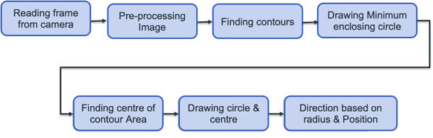
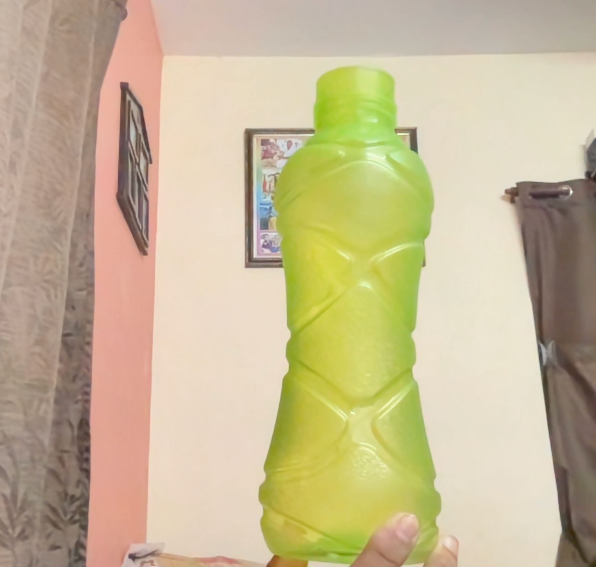
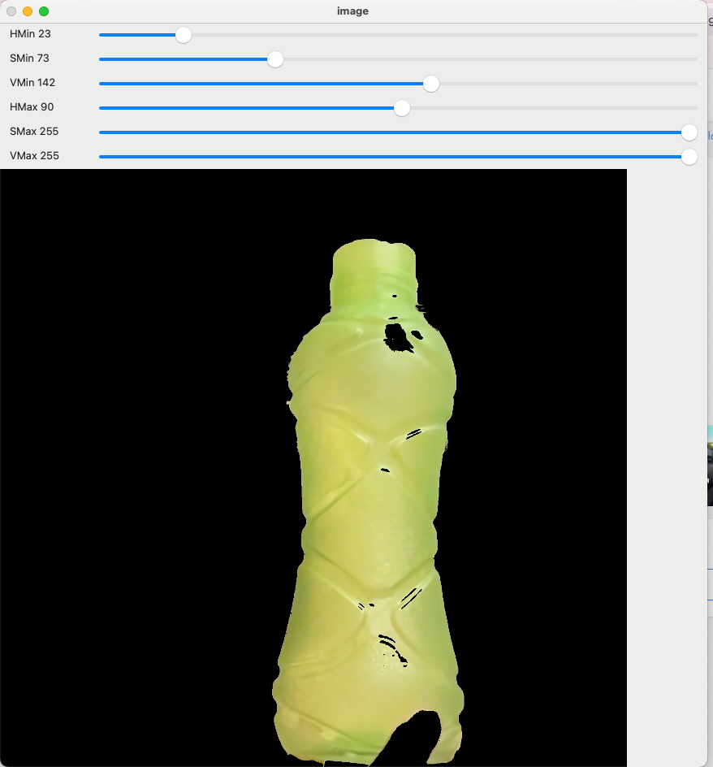
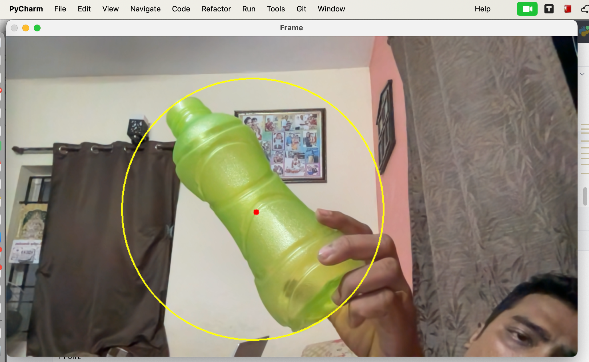

# Face Detection Program

This program uses the OpenCV library to perform real-time face detection using the Haar cascade classifier.

## Requirements
- Python 3.x
- OpenCV library
- imutils library

## Usage
1. Install Python 3.x from [Python's official website](https://www.python.org/downloads/).
2. Install OpenCV library using pip:

    ```bash
    pip install opencv-python imutils
    ```
3. Save the `ColorCalibration_image.py` file in the same directory as the main program..
4. Run the program by executing the following command:
   ```bash
    python Object_Tracking_color.py
    ```
5. The program will open a window and start detecting faces in the live video feed from your default camera.
6. Press "Esc" to exit the program.

## Block Diagram – Workflow of Color Object Tracking

 

## Calibration
For accurate color detection, it's recommended to calibrate the color range values (redLower and redUpper) based on the lighting conditions and the specific shade of red you want to detect. You can use the `ColorCalibration_image.py` file located in the folder for this purpose.

## Code Breakdown

1. **Import Libraries:**

- `imutils:` Provides utility functions for image manipulation (resizing in this case).
- `cv2:` OpenCV library for image processing and computer vision tasks.

2. **Color Range Definition:**

- `redLower` and `redUpper:` Define the lower and upper bounds for the red color in HSV (Hue, Saturation, Value) color space. These values are typically determined using a calibration tool like `ColorCalibration_image.py`. If you don't have this file, you might need to experiment with these values to find what works best for your lighting and object color.

3. **Camera Initialization:**

- `camera = cv2.VideoCapture(0):` Creates a VideoCapture object to access the webcam.

4. **Main Processing Loop (while True):**

- `(grabbed, frame) = camera.read():` Captures a frame from the webcam.
- `frame = imutils.resize(frame, width=1000):` Resizes the frame for better processing efficiency (optional, adjust width as needed).
- `blurred = cv2.GaussianBlur(frame, (11, 11), 0):` Applies Gaussian blurring to reduce noise.
- `hsv = cv2.cvtColor(blurred, cv2.COLOR_BGR2HSV):` Converts the frame from BGR (Blue, Green, Red) to HSV color space for more robust color detection.

5. **Color Mask Generation:**

- `mask = cv2.inRange(hsv, redLower, redUpper):` Creates a mask to isolate the pixels within the defined red color range. This effectively removes background clutter.
- `mask = cv2.erode(mask, None, iterations=2):` Applies erosion to remove small blobs and enhance detection accuracy.
- `mask = cv2.dilate(mask, None, iterations=2):` Applies dilation to fill small holes and connect potential object regions.

6. **Object Contours and Center Detection:**

- `cnts = cv2.findContours(mask.copy(), cv2.RETR_EXTERNAL, cv2.CHAIN_APPROX_SIMPLE)[-2]:` Finds contours (boundaries) of objects in the mask. The [-2] indexing retrieves only the actual contours, not the hierarchy information.
- `center = None:` Initializes a variable to store the object's center.

7. **Object Detection and Movement Analysis (if len(cnts) > 0):**

- `center = (int(M["m10"] / M["m00"]), int(M["m01"] / M["m00"])):`Extracts the center coordinates ((x, y)) from the moments.
- `if radius > 10 (Optional):` Filters out very small objects to avoid noise.

8. **Drawing Overlays:**

- `cv2.circle(frame, (int(x), int(y)), int(radius), (0, 255, 255), 2)`: Draws a green circle around the detected object using its center coordinates ((x, y)) and radius.
- `cv2.circle(frame, center, 5, (0, 0, 255), -1)`: Draws a red circle at the object's center coordinates.

9. **Movement Analysis and Text Overlay:**

- Movement logic is implemented here (modify as needed):
  - You can define thresholds for the `center[0]` (x-coordinate) value to determine if the object is moving Left, Right, or is in the center.
  - The `radius` value can be used to estimate the object's distance (closer if radius is larger).
  - Based on these calculations, you can print appropriate messages like "Stop", "Left", "Right", or "Front" using `print()` statements.
- Consider adding text overlays to the frame using `cv2.putText()` to display the movement direction and estimated distance for better user feedback.

10. **Frame Display and User Input:**

- `cv2.imshow("Frame", frame):` Displays the processed frame with overlays.
key = cv2.waitKey(1) & 0xFF: Waits for a key press.
if key == ord("q"):: Checks if the 'q' key is pressed to quit.

11. **Cleanup:**

- `camera.release():` Releases the webcam resource.
- `cv2.destroyAllWindows():` Closes all OpenCV windows.

## Output

1, **Original Image**



2, **Color Calibrated Image**



Used `Color_Calibration_image.py` and uploaded the bottle image

3, **Output After updating the callibrated color value**


